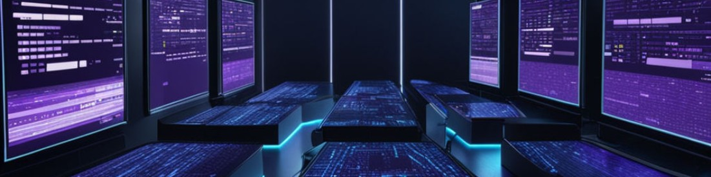

# 👋 Hello there, I’m Guillermo, Franco-Colombian living in France.
# 👀 I’m interested in Web Development and App Design and Development, languages, travels, metal detection, urbex, epoxy resin and I have a collection of old and foreign coins; amongst many other things.
# 🌱 I’m looking forward to ever further improving my computer programming knowledge.
# 💞️ I’m absolutely available to collaborate on a project with you, i'm based in France but you could be located anywhere else, that's not a major problem.
# 📫 So let's get in touch ...

Make sure to go and have look on that page also !! :arrow_heading_down:

https://guillermo-web.fr/cv2D/

<!---
0Memo/0Memo is a ✨ special ✨ repository because its `README.md` (this file) appears on your GitHub profile.
You can click the Preview link to take a look at your changes.
--->
